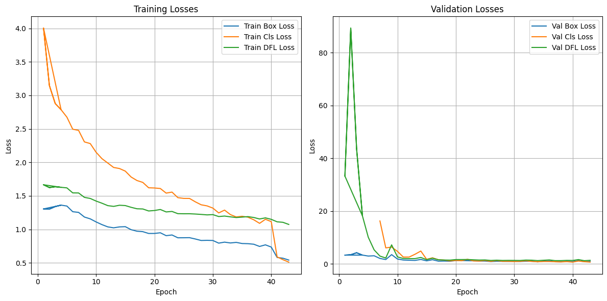
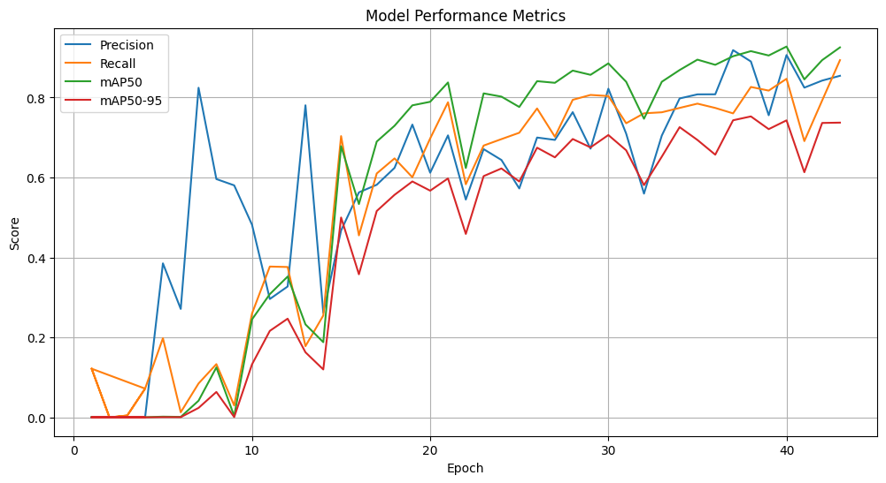

#  Sign Language Translator with YOLO

##  Project Overview
This project is a **real-time sign language translator** that uses **YOLO** (You Only Look Once) to detect and recognize **English alphabet letters** from sign language gestures.  

We fine-tuned a YOLO model using a custom dataset and deployed it for **live camera detection**.  
The system processes camera frames, detects multiple hands in real time, and outputs the most confident predicted letter every 5 frames.  
We intentionally **ignore word prediction** due to higher computational requirements.

---

##  Dataset
- **Source:** Dataset obtained from [Roboflow](https://app.roboflow.com/yolo-qpq86/sign-language-xpq5z-0chb6/1)  
- **Size:** ~27,000 training images, ~2,000 validation images  
- **Augmentation:** Applied image augmentation to improve model generalization  
- **Scope:** Only English alphabet signs (A–Z)  
  - Dataset contains some word signs, but we **ignored them** to focus on letters.

---

##  Why YOLO Instead of Classification?
- **YOLO:** Can detect multiple hands in an image and classify each detected region individually.
- **Classification:** Only outputs a single label for the entire image, making it unsuitable for scenarios with multiple hands.

---

##  Model Training
- **Base Model:** YOLO fine-tuned on our custom dataset
- **Loss Graphs:** Included to show training progress and demonstrate how overfitting was avoided
- **Best Weights:** Saved in the repository for reuse

### Training Results
  
  

---

##  Deployment
- **Live Camera Input:** Captures frames from webcam
- **Frame Processing:** Splits video stream into frames and runs YOLO detection using OpenCV
- **Letter Selection:** Picks the **most confident letter** from each batch of 5 frames for stability
- **Video Demo:**  

  

---

##  Repository Contents
- `best.pt` → Best YOLO model weights  
- `source_code/` → Python source code for training, inference, and deployment  
- `images/` → Loss and accuracy graphs, detection examples, and demo media  
- `video_demo.mp4` → Real-time detection demo video  
- `Real-Time-Sign-Language-Detection-Bridging-the-Communication-Gap.pdf` → PDF explaining current and future features

---

##  Future Features
We plan to enhance this project with:
1. **Word & Sentence Detection** – Expanding dataset and model to recognize full words and sentences.
2. **Mobile Deployment** – Optimizing YOLO for Android/iOS devices.
3. **Multi-Language Support** – Adding sign languages beyond English (e.g. Arabic Sign Language).
4. **Use Generative AI** – Convert speech into images for enhanced communication.
5. **Real-time Translation to Speech** – Converting detected letters or words into spoken language instantly.
